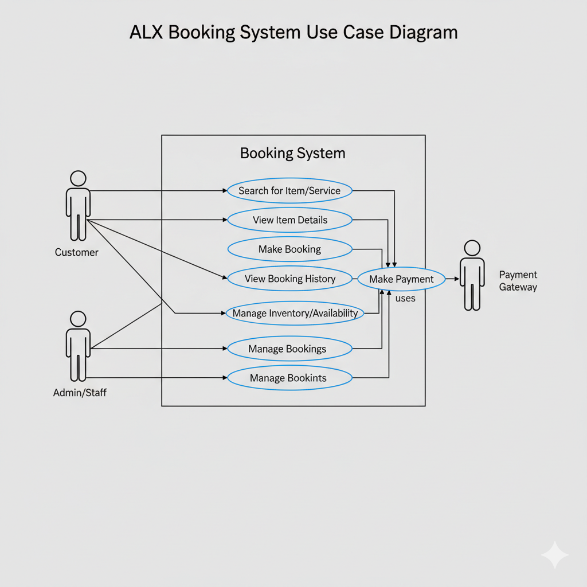

# 🧩 Requirement Analysis in Software Development

## 📘 Introduction

This repository is all about the crucial first step in building software: understanding what the client actually needs. We call this Requirement Analysis.

Think of it like getting the blueprint before you start building a house. If you don't know the client's needs clearly, you could end up building the wrong thing!

These notes, examples, and practical tips will help you learn how clear requirements lead to a good plan (project scope) and ultimately result in efficient software that users will love. It sets the foundation for a successful project!

## What is Requirement Analysis?

**Requirement Analysis** is simply the process of figuring out what a software system needs to do (and not do) before you start building it. It takes messy ideas and turns them into a clear, documented checklist that the whole team follows.

### 🔑 Key components

- **Elicitation** — Collecting requirements from stakeholders (users, product owners, customers, domain experts) using interviews, workshops, surveys, observation, and prototypes.
- **Analysis & Modeling** — Clarifying, resolving conflicts, and modeling requirements (use cases, user stories, flow diagrams, data models).
- **Specification** — Writing precise, unambiguous requirement documents (SRS, user story maps) that developers and testers can act on.
- **Validation & Verification** — Checking requirements with stakeholders to ensure they reflect real needs (reviews, walkthroughs, acceptance criteria).
- **Prioritization & Management** — Ranking requirements by value, risk, and effort and tracking changes through versioning or a backlog.

### 🎯 Why it matters in the SDLC

As a key early step in the **SDLC**, Requirement Analysis strongly influences all subsequent phases of software development.

- **Design**: Clear requirements enable architects and engineers to create appropriate, cost-effective designs.
- **Implementation**: Developers write correct code faster when requirements are precise and testable.
- **Testing & QA**: Well-defined acceptance criteria and requirements make it possible to design meaningful tests and measure readiness.
- **Project Management**: Accurate scoping and prioritization reduce rework, unplanned scope creep, and budget overruns.
- **Maintenance & Evolution**: Documented requirements and their rationale make future updates, refactors, and bug fixes safer and quicker.
- **Stakeholder Satisfaction**: Continuous validation reduces misunderstandings and increases the chance the delivered product meets user needs.

### ⚠️ Common pitfalls

- Ambiguous or contradictory requirements
- Missing stakeholder voices or hidden requirements
- Overlooking non-functional needs (e.g., performance or security)
- Poor change management leading to scope creep
- Not validating requirements early with real users

### ✅ Best practices

- Involve diverse stakeholders early and often.
- Use multiple elicitation techniques (interviews + prototypes + observation).
- Write requirements that are **clear, measurable, and testable**.
- Prioritize ruthlessly—deliver highest-value items first.
- Maintain a single source of truth (SRS, product backlog) and track changes.
- Validate continuously with prototypes or MVPs before full-scale development.

## 💡 Why is Requirement Analysis Important?

Requirement Analysis is one of the **most critical phases** in the Software Development Lifecycle (SDLC). It ensures that the software being developed aligns with business goals, user expectations, and technical feasibility. Without proper analysis, projects risk delays, budget overruns, or failure to meet user needs.

### 🔍 1. Ensures Clear Understanding of Project Goals

Proper analysis bridges the gap between **stakeholders** and **developers**, translating business needs into actionable requirements.  
This prevents misunderstandings, conflicting expectations, and costly rework during later stages of development.

### 🧭 2. Guides Design and Development

Requirement Analysis provides a **blueprint** for the design and implementation phases.  
When requirements are clearly defined, developers can create accurate architectures, write cleaner code, and deliver features that match user expectations.

### ⚙️ 3. Improves Quality and Reduces Cost

By identifying potential issues and missing requirements early, teams can **avoid errors** that are far more expensive to fix later in the SDLC.  
Thorough analysis ensures the final product is **reliable, scalable, and user-centered**, leading to higher satisfaction and reduced maintenance costs.

### 🚀 In summary

A strong Requirement Analysis phase lays the foundation for project success by ensuring:

- The **right problem** is being solved
- Resources are **efficiently utilized**
- The end product **delivers real value** to users and stakeholders

## 🧠 Key Activities in Requirement Analysis

The Requirement Analysis phase consists of several structured activities that ensure all stakeholders’ needs are correctly identified, understood, and documented.  
Below are the **five key activities** involved in this process:

---

### 1. 📝 Requirement Gathering

This is the **first step** in understanding what stakeholders expect from the system.  
It involves collecting raw requirements from various sources such as clients, end-users, business analysts, and domain experts.  
**Techniques used:** interviews, questionnaires, observation, document analysis, and reviewing existing systems.

> 🎯 _Goal:_ Capture all potential needs and constraints from every stakeholder involved.

---

### 2. 💬 Requirement Elicitation

Elicitation focuses on **clarifying and uncovering hidden or implicit needs** that stakeholders may not directly express.  
It’s about asking the right questions and engaging stakeholders to get detailed, actionable insights.

**Common techniques:** brainstorming sessions, workshops, focus groups, and prototyping.

> 🎯 _Goal:_ Transform broad ideas into well-understood, specific, and relevant requirements.

---

### 3. 📄 Requirement Documentation

Once gathered and elicited, requirements are formally **documented** to create a reference point for all team members.  
Documentation ensures consistency, clarity, and traceability throughout the SDLC.

**Examples of documentation:**

- Software Requirements Specification (SRS)
- User stories and acceptance criteria
- Use case diagrams and requirement matrices

> 🎯 _Goal:_ Record requirements in a clear, structured, and accessible manner.

---

### 4. ⚙️ Requirement Analysis and Modeling

This stage involves **analyzing the collected requirements** to identify conflicts, dependencies, priorities, and feasibility.  
Modeling helps visualize how requirements interact with the system using diagrams and structured models.

**Common modeling tools:** UML diagrams, data flow diagrams (DFDs), entity-relationship diagrams (ERDs), and process flowcharts.

> 🎯 _Goal:_ Ensure the requirements are feasible, consistent, complete, and logically structured.

---

### 5. ✅ Requirement Validation

The final step ensures that the documented requirements **accurately represent stakeholder needs** and align with business objectives.  
Validation is typically done through reviews, walkthroughs, and stakeholder feedback sessions.

**Key focus areas:**

- Correctness
- Completeness
- Consistency
- Testability

> 🎯 _Goal:_ Confirm that the right requirements are defined before moving into design and development.

---

Effective execution of these five activities guarantees that the software project starts on a solid foundation — minimizing risk, enhancing quality, and ensuring stakeholder satisfaction.

## 📋 Types of Requirements

Below are the two main types of requirements, with definitions and examples tailored for a booking management project (e.g. ticket or reservation system).

### 1. Functional Requirements

**Definition:**  
Functional requirements describe **what** the system must do — the specific behaviors, features, and operations that deliver business value to users.

**Examples (for a booking management system):**

- A user can **search available slots or services** (e.g. rooms, seats, flights) based on date, location, or other filters.
- The system allows users to **make a booking / reservation**, specifying user details, time, quantity, and confirmation.
- Users can **cancel or modify** existing bookings (within policy limits).
- The system should **send email or SMS notifications** upon booking confirmation, cancellation, or reminders.
- Admin can **view, approve, or reject bookings**, see booking history, generate reports.
- The system supports **payment processing**, integrating with payment gateways (e.g. card, mobile money).

https://miro.medium.com/v2/resize:fit:720/format:webp/1*23U2OxzOo4R8arOJhFbtpw.png

### 2. Non-functional Requirements

**Definition:**  
Non-functional requirements (NFRs) define **how** the system performs or under what constraints — quality attributes, performance, reliability, security, usability, etc.

**Examples (for the same booking management system):**

- **Performance / Response Time**: The system must respond to a search request within 2 seconds under 1,000 concurrent users.
- **Availability / Uptime**: The system must be available at least 99.9% of the time (downtime < 8.76 hours/year).
- **Scalability**: As usage grows, the system must handle doubling of load without degradation.
- **Security**: All sensitive data (user credentials, payment info) must be stored encrypted. Communications must use TLS/SSL.
- **Usability**: The booking interface must be intuitive; a new user should complete a booking in ≤ 5 steps.
- **Maintainability**: The system should permit updates or fixes with minimal downtime (rolling deployments).
- **Compatibility / Portability**: Must support modern browsers (Chrome, Firefox, Safari) and mobile devices (iOS, Android).

https://miro.medium.com/v2/resize:fit:720/format:webp/1*Jv-59Dts74UJ8c1SeHAKVQ.png

## 🎨 Use Case Diagrams

### 🧾 What is a Use Case Diagram?

A **Use Case Diagram** is a visual representation of how users (called _actors_) interact with a system to achieve specific goals.  
It focuses on _what_ the system does — rather than _how_ it does it — helping developers and stakeholders understand functionality from the user’s perspective.

Use case diagrams are part of **Unified Modeling Language (UML)** and are especially helpful in requirement analysis to visualize user interactions and system scope.

### 🌟 Benefits of Use Case Diagrams

- **Clarity of System Scope:** Shows the boundary between the system and external users or systems.
- **Improved Communication:** Bridges understanding between business stakeholders and technical teams.
- **Early Validation:** Helps confirm that all required interactions are captured before development begins.
- **Documentation Aid:** Serves as a simple, reusable reference for design and testing teams.

---

### 🧍 Actors and Use Cases for the Booking System

#### 👤 **Actors:**

- **Customer:** Searches, books, modifies, or cancels reservations.
- **Administrator:** Manages bookings, reviews reports, and handles user or system maintenance.
- **Payment Gateway:** Processes transactions securely.

#### 🧩 **Main Use Cases:**

- Search available bookings
- Make a reservation
- Modify or cancel booking
- Make payment
- Receive confirmation notifications
- View booking history
- Manage bookings (Admin)
- Generate reports (Admin)

---

### 🖼️ Use Case Diagram

Below is the use case diagram for the **Booking Management System**, designed using **Draw.io** and exported as `alx-booking-uc.png`.

-

## ✅ Acceptance Criteria

### 📘 What is Acceptance Criteria?

**Acceptance Criteria** are predefined conditions that a software feature must meet to be accepted by the client, user, or product owner.  
They define _what success looks like_ for each requirement or user story — ensuring the developed feature behaves as expected and satisfies business needs.

---

### 🌟 Importance in Requirement Analysis

- **Clarity & Alignment:** They ensure all stakeholders (developers, testers, and clients) share a common understanding of what “done” means for each feature.
- **Testability:** Each criterion provides a measurable condition that can be tested, making verification straightforward.
- **Scope Control:** Helps prevent feature creep by defining exactly what should (and should not) be delivered.
- **Quality Assurance:** Reduces ambiguity, improves communication, and ensures the final output matches user expectations.

---

### 🧩 Example — _Checkout Feature in Booking Management System_

**Feature:** As a customer, I want to complete my booking and make a secure payment so that I can confirm my reservation.

**Acceptance Criteria:**

1. ✅ The system must display a checkout page summarizing the selected booking details (date, time, price, and service).
2. ✅ The user must be able to choose a payment method (e.g., card, wallet, or bank transfer).
3. ✅ The system must securely process the payment via the integrated payment gateway.
4. ✅ If the payment is successful, the system must generate a booking confirmation and send an email/SMS notification to the user.
5. ✅ If the payment fails, the system must display an appropriate error message and allow the user to retry or choose another method.
6. ✅ All payment transactions must be logged with a unique transaction ID for tracking and auditing.
7. ✅ The system must update the booking status to “Confirmed” only after successful payment validation.

---
